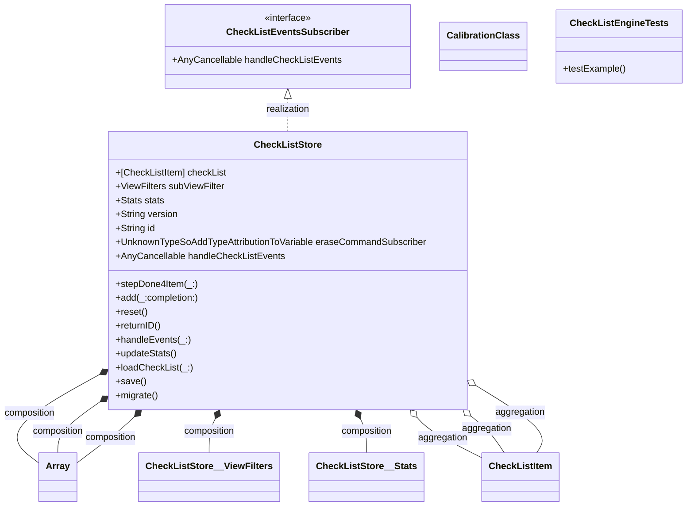

```mermaid
classDiagram

  class CheckListEventsSubscriber {
    <<interface>>
    +AnyCancellable handleCheckListEvents
  }


  class CalibrationClass {
  }


  class CheckListEngineTests {
    +testExample() 
  }


  class CheckListStore {
    +[CheckListItem] checkList
    +ViewFilters subViewFilter
    +Stats stats
    +String version
    +String id
    +UnknownTypeSoAddTypeAttributionToVariable eraseCommandSubscriber
    +AnyCancellable handleCheckListEvents
    +stepDone4Item(_:) 
    +add(_:completion:) 
    +reset() 
    +returnID() 
    +handleEvents(_:) 
    +updateStats() 
    +loadCheckList(_:) 
    +save() 
    +migrate() 
  }
  CheckListEventsSubscriber <|.. CheckListStore : realization
  CheckListStore *-- Array : composition
  CheckListStore *-- CheckListStore__ViewFilters : composition
  CheckListStore *-- CheckListStore__Stats : composition
  CheckListStore *-- Array : composition
  CheckListStore *-- Array : composition
  CheckListStore o-- CheckListItem : aggregation
  CheckListStore o-- CheckListItem : aggregation
  CheckListStore o-- CheckListItem : aggregation

```
