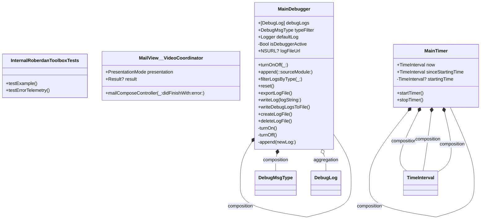

```mermaid
classDiagram

  class InternalRoberdanToolboxTests {
    +testExample() 
    +testErrorTelemetry() 
  }


  class MailView__VideoCoordinator {
    +PresentationMode presentation
    +Result<MFMailComposeResult, Error>? result
    +mailComposeController(_:didFinishWith:error:) 
  }


  class MainDebugger {
    +[DebugLog] debugLogs
    +DebugMsgType typeFilter
    +Logger defaultLog
    -Bool isDebuggerActive
    +NSURL? logFileUrl
    +turnOnOff(_:) 
    +append(_:_:sourceModule:) 
    +filterLogsByType(_:) 
    +reset() 
    +exportLogFile() 
    +writeLog(logString:) 
    +writeDebugLogsToFile() 
    +createLogFile() 
    +deleteLogFile() 
    -turnOn() 
    -turnOff() 
    -append(newLog:) 
  }
  MainDebugger *-- MainDebugger : composition
  MainDebugger *-- DebugMsgType : composition
  MainDebugger o-- DebugLog : aggregation


  class MainTimer {
    +TimeInterval now
    +TimeInterval sinceStartingTime
    -TimeInterval? startingTime
    +startTimer() 
    +stopTimer() 
  }
  MainTimer *-- MainTimer : composition
  MainTimer *-- TimeInterval : composition
  MainTimer *-- TimeInterval : composition
  MainTimer *-- TimeInterval : composition

```
