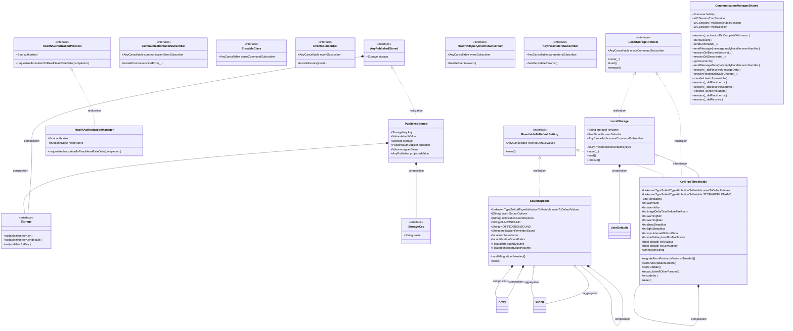

```mermaid
classDiagram

  class AnyPublishedStored {
    <<interface>>
    +Storage storage
  }
  AnyPublishedStored *-- Storage : composition


  class CommunicationErrorSubscriber {
    <<interface>>
    +AnyCancellable communicationErrorSubscriber
    +handleCommunicationError(_:) 
  }


  class ErasableClass {
    <<interface>>
    +AnyCancellable eraseCommandSubscriber
  }


  class EventsSubscriber {
    <<interface>>
    +AnyCancellable eventSubscriber
    +handleEvents(event:) 
  }


  class HealthAuthorizationProtocol {
    <<interface>>
    +Bool authorized
    +requestAuthorizationToReadHeartRateData(completion:) 
  }


  class HealthKitQueryEventsSubscriber {
    <<interface>>
    +AnyCancellable eventSubscriber
    +handleEvents(event:) 
  }


  class KeyParametersSubscriber {
    <<interface>>
    +AnyCancellable parametersSubscriber
    +handleUpdateParams() 
  }


  class LocalStorageProtocol {
    <<interface>>
    +AnyCancellable eraseCommandSubscriber
    +save(_:) 
    +load() 
    +remove() 
  }


  class ResettableToDefaultSetting {
    <<interface>>
    +AnyCancellable resetToDefaultValues
    +reset() 
  }


  class Storage {
    <<interface>>
    +codable(type:forKey:) 
    +codable(type:forKey:default:) 
    +set(codable:forKey:) 
  }


  class StorageKey {
    <<interface>>
    +String value
  }


  class CommunicationManagerShared {
    +Bool reachability
    +WCSession? wcSession
    +WCSession? validReachableSession
    +WCSession? validSession
    +session(_:activationDidCompleteWith:error:) 
    +startSession() 
    +sendCommand(_:) 
    +sendMessage(message:replyHandler:errorHandler:) 
    +sessionDidBecomeInactive(_:) 
    +sessionDidDeactivate(_:) 
    +getDeviceInfo() 
    +sendMessageData(data:replyHandler:errorHandler:) 
    +session(_:didReceiveMessageData:) 
    +sessionReachabilityDidChange(_:) 
    +transferUserInfo(userInfo:) 
    +session(_:didFinish:error:) 
    +session(_:didReceiveUserInfo:) 
    +transferFile(file:metadata:) 
    +session(_:didFinish:error:) 
    +session(_:didReceive:) 
  }


  class HealthAuthorizationManager {
    +Bool authorized
    -HKHealthStore healthStore
    +requestAuthorizationToReadHeartRateData(completion:) 
  }
  HealthAuthorizationProtocol <|.. HealthAuthorizationManager : realization


  class KeyFlowThresholds {
    +UnknownTypeSoAddTypeAttributionToVariable resetToDefaultValues
    +UnknownTypeSoAddTypeAttributionToVariable STORAGEFILENAME
    -Bool isInitiating
    +Int alarmMin
    +Int alarmMax
    +Int triageDeltaTimeBeforeFireAlarm
    +Int warningMin
    +Int warningMax
    +Int deepSleepMax
    +Int lightSleepMax
    +Int maxIntervalWithoutData
    +Int minBatteryLevelForNotification
    +Bool shouldFireNoData
    +Bool shouldFireLowBattery
    +String jsonString
    +migrateFromPreviousVersionsIfNeeded() 
    +storeAndUpdateMarkers() 
    +storeUpdate() 
    +recalculateAllOtherParams() 
    +encode(to:) 
    +reset() 
  }
  LocalStorage <|-- KeyFlowThresholds : inheritance
  LocalStorageProtocol <|.. KeyFlowThresholds : realization
  ResettableToDefaultSetting <|.. KeyFlowThresholds : realization
  KeyFlowThresholds *-- KeyFlowThresholds : composition


  class LocalStorage {
    +String storageFileName
    -UserDefaults userDefaults
    +AnyCancellable eraseCommandSubscriber
    -isKeyPresentInUserDefaults(key:) 
    +save(_:) 
    +load() 
    +remove() 
  }
  LocalStorageProtocol <|.. LocalStorage : realization
  LocalStorage *-- UserDefaults : composition


  class PublishedStored {
    +StorageKey key
    +Value defaultValue
    +Storage storage
    +PassthroughSubject<Value?, Never> publisher
    +Value wrappedValue
    +AnyPublisher<Value?, Never> projectedValue
  }
  AnyPublishedStored <|.. PublishedStored : realization
  PublishedStored *-- StorageKey : composition
  PublishedStored *-- Storage : composition


  class SoundOptions {
    +UnknownTypeSoAddTypeAttributionToVariable resetToDefaultValues
    +[String] alarmSoundOptions
    +[String] notificationSoundOptions
    +String ALARMSOUND
    +String NOTIFICATIONSOUND
    +String medicationReminderSound
    +Int alarmSoundIndex
    +Int notificationSoundIndex
    +Float alarmSoundVolume
    +Float notificationSoundVolume
    -handleMigrationIfNeeded() 
    +reset() 
  }
  ResettableToDefaultSetting <|.. SoundOptions : realization
  SoundOptions *-- SoundOptions : composition
  SoundOptions *-- Array : composition
  SoundOptions *-- Array : composition
  SoundOptions o-- String : aggregation
  SoundOptions o-- String : aggregation

```
