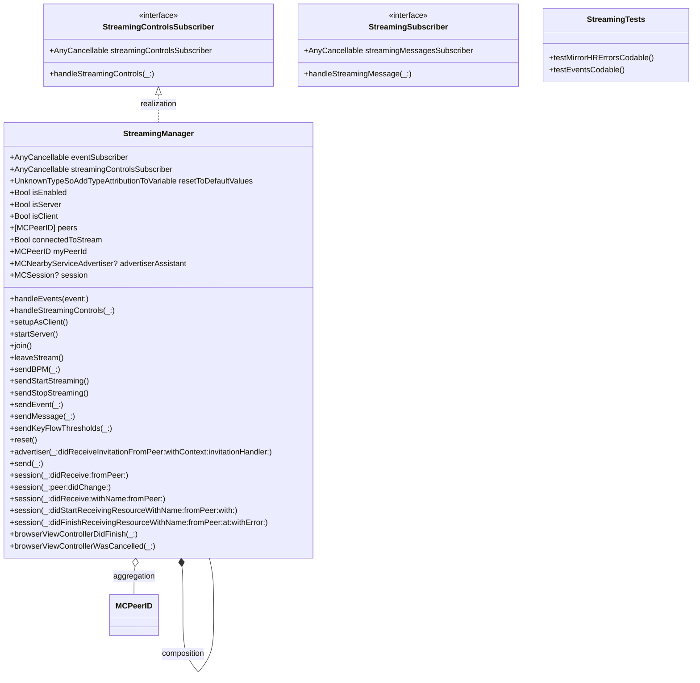

```mermaid
classDiagram

  class StreamingControlsSubscriber {
    <<interface>>
    +AnyCancellable streamingControlsSubscriber
    +handleStreamingControls(_:) 
  }


  class StreamingSubscriber {
    <<interface>>
    +AnyCancellable streamingMessagesSubscriber
    +handleStreamingMessage(_:) 
  }


  class StreamingManager {
    +AnyCancellable eventSubscriber
    +AnyCancellable streamingControlsSubscriber
    +UnknownTypeSoAddTypeAttributionToVariable resetToDefaultValues
    +Bool isEnabled
    +Bool isServer
    +Bool isClient
    +[MCPeerID] peers
    +Bool connectedToStream
    +MCPeerID myPeerId
    +MCNearbyServiceAdvertiser? advertiserAssistant
    +MCSession? session
    +handleEvents(event:) 
    +handleStreamingControls(_:) 
    +setupAsClient() 
    +startServer() 
    +join() 
    +leaveStream() 
    +sendBPM(_:) 
    +sendStartStreaming() 
    +sendStopStreaming() 
    +sendEvent(_:) 
    +sendMessage(_:) 
    +sendKeyFlowThresholds(_:) 
    +reset() 
    +advertiser(_:didReceiveInvitationFromPeer:withContext:invitationHandler:) 
    +send(_:) 
    +session(_:didReceive:fromPeer:) 
    +session(_:peer:didChange:) 
    +session(_:didReceive:withName:fromPeer:) 
    +session(_:didStartReceivingResourceWithName:fromPeer:with:) 
    +session(_:didFinishReceivingResourceWithName:fromPeer:at:withError:) 
    +browserViewControllerDidFinish(_:) 
    +browserViewControllerWasCancelled(_:) 
  }
  StreamingControlsSubscriber <|.. StreamingManager : realization
  StreamingManager *-- StreamingManager : composition
  StreamingManager o-- MCPeerID : aggregation


  class StreamingTests {
    +testMirrorHRErrorsCodable() 
    +testEventsCodable() 
  }

```
