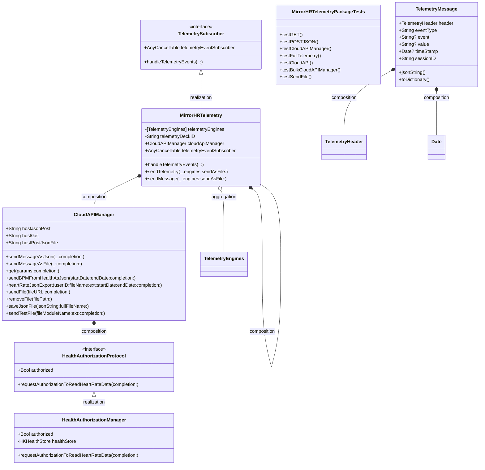

```mermaid
classDiagram

  class HealthAuthorizationProtocol {
    <<interface>>
    +Bool authorized
    +requestAuthorizationToReadHeartRateData(completion:) 
  }


  class TelemetrySubscriber {
    <<interface>>
    +AnyCancellable telemetryEventSubscriber
    +handleTelemetryEvents(_:) 
  }


  class CloudAPIManager {
    +String hostJsonPost
    +String hostGet
    +String hostPostJsonFile
    +sendMessageAsJson(_:completion:) 
    +sendMessageAsFile(_:completion:) 
    +get(params:completion:) 
    +sendBPMFromHealthAsJson(startDate:endDate:completion:) 
    +heartRateJsonExport(userID:fileName:ext:startDate:endDate:completion:) 
    +sendFile(fileURL:completion:) 
    +removeFile(filePath:) 
    +saveJsonFile(jsonString:fullFileName:) 
    +sendTestFile(fileModuleName:ext:completion:) 
  }
  CloudAPIManager *-- HealthAuthorizationProtocol : composition


  class HealthAuthorizationManager {
    +Bool authorized
    -HKHealthStore healthStore
    +requestAuthorizationToReadHeartRateData(completion:) 
  }
  HealthAuthorizationProtocol <|.. HealthAuthorizationManager : realization


  class MirrorHRTelemetry {
    -[TelemetryEngines] telemetryEngines
    -String telemetryDeckID
    +CloudAPIManager cloudApiManager
    +AnyCancellable telemetryEventSubscriber
    +handleTelemetryEvents(_:) 
    +sendTelemetry(_:engines:sendAsFile:) 
    +sendMessage(_:engines:sendAsFile:) 
  }
  TelemetrySubscriber <|.. MirrorHRTelemetry : realization
  MirrorHRTelemetry *-- MirrorHRTelemetry : composition
  MirrorHRTelemetry *-- CloudAPIManager : composition
  MirrorHRTelemetry o-- TelemetryEngines : aggregation


  class MirrorHRTelemetryPackageTests {
    +testGET() 
    +testPOSTJSON() 
    +testCloudAPIManager() 
    +testFullTelemetry() 
    +testCloudAPI() 
    +testBulkCloudAPIManager() 
    +testSendFile() 
  }


  class TelemetryMessage {
    +TelemetryHeader header
    +String eventType
    +String? event
    +String? value
    +Date? timeStamp
    +String sessionID
    +jsonString() 
    +toDictionary() 
  }
  TelemetryMessage *-- TelemetryHeader : composition
  TelemetryMessage *-- Date : composition

```
